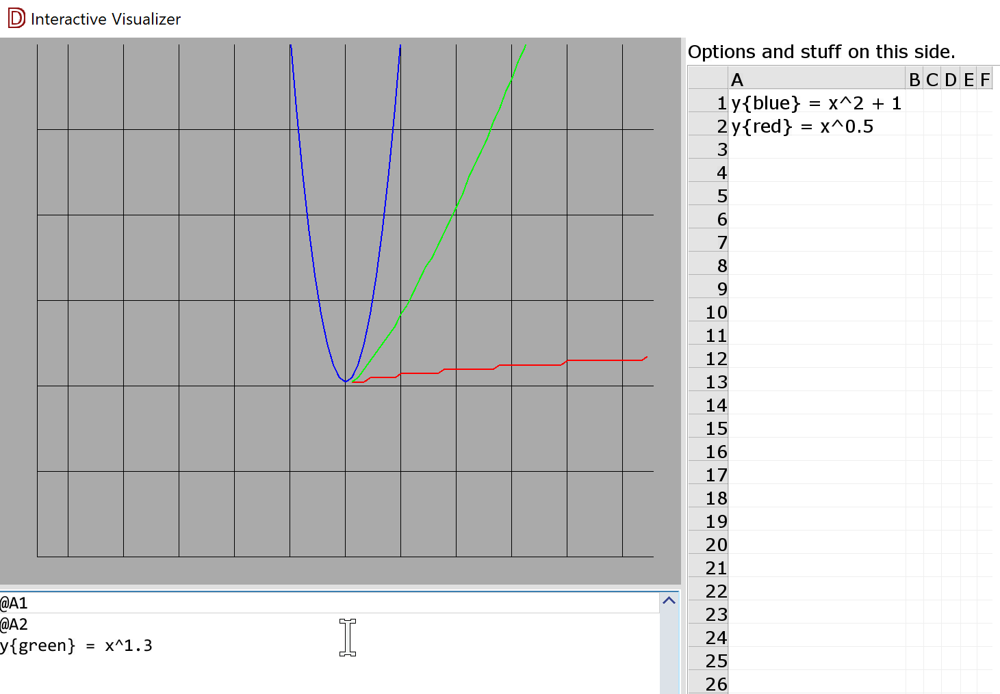

# Interactive Visualizer

This is an attempt at real-time, interactive graphs and charts. I want to be
able to grab a table and work with its data visually, more efficiently, and
with more flexibility than is possible with Excel.

You'll need to grab [plot2d](https://github.com/deviator/plot2d/) ~master to
build (or, version > 0.1.4).

Possible idea of what this could look like (no functionality currently):

